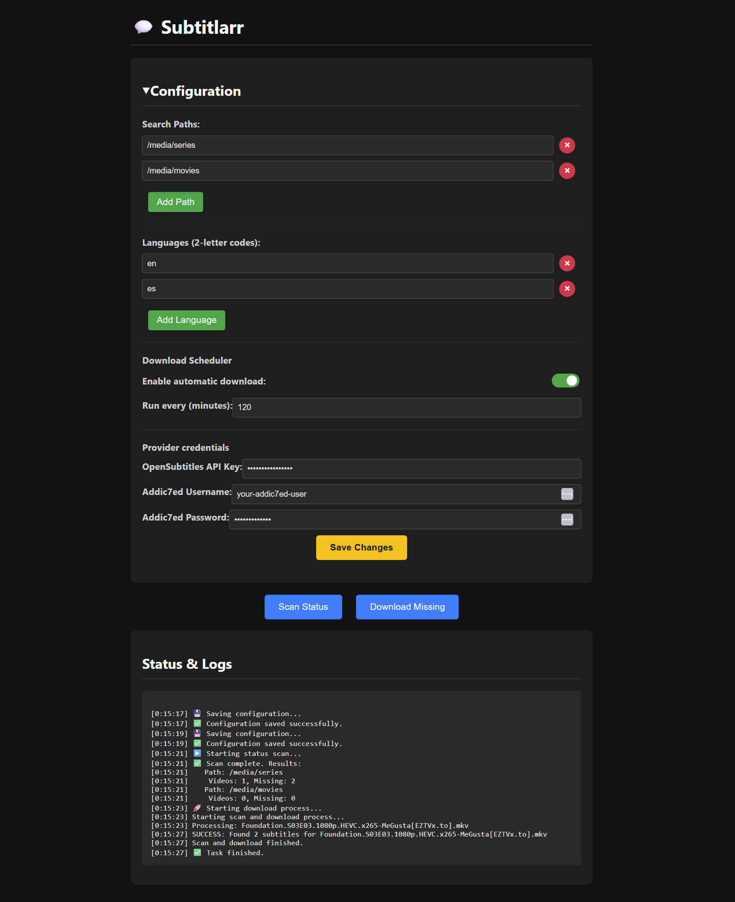

# 💬 Subtitlarr
A simple web UI and automation tool wrapping the excellent `subliminal` library, created to automatically and effortlessly download subtitles for your media library.


*(**Note**: The screenshot should be updated to show the new 'Settings' tab with the provider credentials sections).*

## Features
* **Web Interface**: Manage media paths, languages, and all settings from a clean UI.
* **Multi-Provider Support**: Fetches subtitles from OpenSubtitles.com, OpenSubtitles.org (legacy), Addic7ed, and more.
* **API Key Authentication**: Use your OpenSubtitles.com API key.
* **Built-in Scheduler**: Set it and forget it. The app can periodically scan for and download missing subtitles.
* **Efficient Scanning**: Avoids unnecessary searches for subtitles that already exist on your disk.
* **Dockerized**: Easy to deploy and manage using Docker and Docker Compose.
* **Notifications**: Get notified via webhooks (Discord, Slack, etc.) when tasks start, finish, or fail.


## Usage (Docker Recommended)
The easiest and recommended way to run Subtitlarr is with Docker Compose.

### 1. Using `docker-compose.yaml`
1.  Save the `docker-compose.yaml` file provided in the repository to a directory on your machine.
2.  In the same directory, create a `config.json` file. You can leave it as an empty JSON object `{}` on the first run; the application will populate it with default values.
3.  Edit the `docker-compose.yaml` file:
    * Set your user and group IDs (`PUID` and `PGID`) to avoid permission issues with your media files.
    * Update the volume mounts to point to your media folders (e.g., `/path/to/your/series` and `/path/to/your/movies`).
    * **(Optional)** Uncomment and fill in the environment variables for your subtitle provider credentials.
4.  Run the container from that directory:
    ```bash
    docker-compose up -d
    ```
5.  Access the web UI at `http://localhost:5000`.

### 2. Using `docker run`
If you prefer not to use Docker Compose, you can run the container manually. Ensure you have a local directory (e.g., `~/subtitlarr_data`) to store the configuration and cache.

```bash
# Create a directory to store config and cache
mkdir -p ~/subtitlarr_data

# Run the container
docker run -d \
  -p 5000:5000 \
  -e PUID=1000 \
  -e PGID=1000 \
  -e OPENSUBTITLESCOM_APIKEY='your_api_key_here' \
  -v ~/subtitlarr_data/config.json:/app/config.json \
  -v ~/subtitlarr_data/cache:/app/cache \
  -v /path/to/your/series:/media/series \
  -v /path/to/your/movies:/media/movies \
  --name subtitlarr \
  subtitlarr:latest
```


## Configuration
Subtitlarr can be configured in three ways, with the following order of precedence:

- Environment Variables (Highest precedence, overrides everything else)
- Web UI
- config.json file (Lowest precedence)


### Provider Credentials

You can provide credentials for subtitle providers using environment variables, which is recommended when using Docker.

| Provider | Environment Variable | Description |
|----------|----------------------|-------------|
|OpenSubtitles.com|`OPENSUBTITLESCOM_USERNAME`|Your username.|
| |`OPENSUBTITLESCOM_PASSWORD`|Your password.|
| |`OPENSUBTITLESCOM_APIKEY`|(Recommended) Your API key. Takes precedence over password.|
|OpenSubtitles.org|`OPENSUBTITLES_USERNAME`|Your username.|
| |`OPENSUBTITLES_PASSWORD`|Your password.|
|Addic7ed|`ADDIC7ED_USERNAME`|Your username.|
| |`ADDIC7ED_PASSWORD`|Your password.|

## License

This project is licensed under the [MIT License](LICENSE)